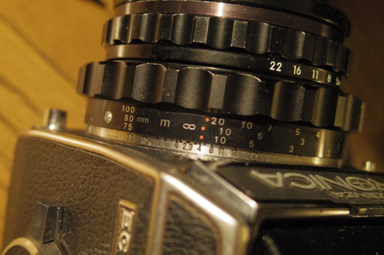

# Bronica S2 focusing scale generator

The Bronica S2 series uses a helicoid separate from the camera.  The focusing scale is a thin metal strip, secured to the helicoid with three tiny screws.

The stock scale can combine up to four focal lengths on one scale, but there are only a few variations of it, and it sucks for you if the lenses you use most don't appear on them.



This tool lets you pick one to three lens focal lengths (and your units between feet and meters).

It generates for you a strip with the scale(s) for those focal length(s), sized to be a perfect replacement for the stock ones.

For printing to paper, there's a PDF output (with size calibration scale - make sure you're printing at 100% scale!).  I've found that paper glued to a brass strip and sealed with a sealer spray works pretty well.  However, if you'd rather go for an engraved metal one directly, there's also DXF output.

Use debug for a strip showing bare helicoid extension.

The scales generated match the stock ones, as well as the additional scales provided in the S2 and EC manuals.
Only the 45, 85, and 105mm scales are worked out by extrapolation.


**I have deployed this app at https://brianssparetime.pythonanywhere.com/** so you can use it directly.

This page is for running it locally (either as a webserver or as a commandline tool).

## Output

The PDF includess a 1 cm and a 1 inch reference line (you must change print size to 100%; not the default fit-to-page).  Check them with a ruler before trusting the strip. 

The DXF carries the outline and slots on a `CUT` layer and the dots and text on an
`ENGRAVE` layer.


## Setup

```
python3 -m venv .venv
.venv/bin/pip install -r requirements.txt
```

## Command line

Writes named files into an output directory.

```
.venv/bin/python cli.py --unit meters --focal 75 --focal 150 --format both --out ./out
.venv/bin/python cli.py --unit feet --focal 100 --format pdf
.venv/bin/python cli.py --debug --format dxf
```

Options: `--unit feet|meters`, `--focal` (repeat up to three), `--format
pdf|dxf|both`, `--out`, `--page letter|a4`, `--debug` for the bare extension
strip.

## Website

```
.venv/bin/python web.py --port 8085
```

Serves a form at http://localhost:8085 and streams the result as a download.


